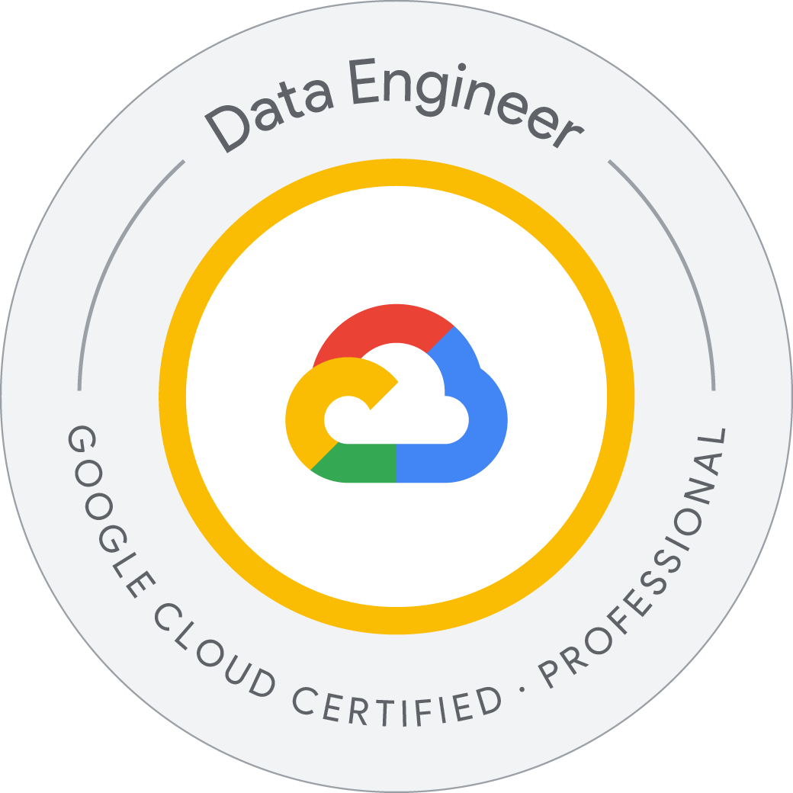
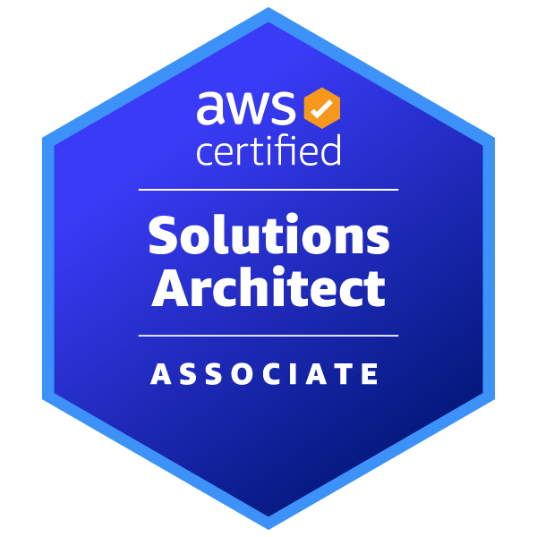

# 👋 Hi there, welcome to my professional world!

I'm **Ganasai Palakurthi**, a Full Stack Developer and Data Engineer with over **6 years of experience** in application development, full dev-to-prod lifecycle, CI/CD, deployments, cloud, and Data/AI/ML exploration.

---

## 💼 Professional Summary
- 6+ years of experience in **application development, deployment, and CI/CD pipelines**.  
- Experienced across the **full dev-to-prod lifecycle**, from design & analysis to production deployment.  
- Skilled in **cloud platforms (AWS, GCP)**, **Docker**, **Kubernetes**, and building **scalable ETL/data pipelines**.  
- Strong experience with **Java, JavaScript, SQL, Python**, and modern web technologies including **Angular, Spring Boot, and RESTful APIs**.  
- Proficient in **RDBMS (Oracle, MySQL, SQL Server)** and **NoSQL databases (MongoDB, Cassandra)**.  
- Hands-on experience with **data processing frameworks**: Spark (PySpark), Hadoop, Hive, Kafka, MLlib.  
- Currently exploring **Data & AI/ML**, machine learning models, and big data analytics.  
- Familiar with **DevOps best practices**: build tools (Maven, Gradle, Ant), CI/CD (Jenkins), containerization & orchestration (Docker, Kubernetes).  
- Experienced in **software development methodologies**: Agile, Scrum, RUP, and using tools like Jira & Rally.  
- Adept at collaborating in **cross-functional teams**, mentoring juniors, and driving **end-to-end project delivery**.  
- Passionate about **innovation, cloud-native architectures, and data-driven solutions**, continuously learning new technologies.

---

## 🎓 Education

- **Master's in Computer Science**, Kent State University, May 2025. 
- will include few projects and courses
- **Bachelor's in Electronics and Communication Engineering**, JNTUK, May 2019.  
- should include few personal projects

---

## 🛠️ Tech Stack

| Category                  | Technologies |
|---------------------------|--------------|
| **Operating Systems**     | Windows, Unix, Linux |
| **Languages**             | Java, JavaScript, Python, SQL, HQL, PL/SQL |
| **Java / J2EE Technologies** | Java EE, Servlets, JSP, JSTL, XSLT, JDBC, JNDI, JMS, JPA, JSF |
| **Web Technologies**      | HTML5, CSS3, JavaScript, AJAX, Angular 4/5/6, Angular JS, Angular 14, jQuery, Express, Bootstrap |
| **XML / Web Services**    | XML, XSD, SOA, WSDL, SOAP, Apache CXF, DOM, SAX, JAXWS, JAXRS, XML Beans, REST, JAXB, Restful |
| **Frameworks**            | Struts, Hibernate ORM, Spring MVC, Spring Boot, Spring AOP, Selenium, Mockito, JUnit, Protractor, Cucumber |
| **Databases**             | **RDBMS:** Oracle, MySQL, SQL-Server   **NoSQL:** MongoDB, Cassandra |
| **Data & AI/ML**          | Pandas, NumPy, Scikit-learn, TensorFlow, PyTorch, Spark (PySpark), MLlib, Hadoop, Hive, Kafka |
| **Web / Application Servers** | Apache Tomcat, JBoss, WebSphere, WebLogic |
| **IDEs**                  | Eclipse, STS, IntelliJ, WebStorm |
| **Cloud / Platforms**     | **AWS:** IAM, EC2, CloudWatch, ELB, Elastic Beanstalk, VPC, S3, EBS, CloudFormation, Storage Gateway, AutoScaling, NLB, ALB, RDS, SNS, Route 53, Redshift, SageMaker, Athena, EMR, Glue, Kinesis   **GCP:** Compute Engine, Cloud Storage, VPC, BigQuery, Pub/Sub, Cloud Functions, Kubernetes Engine, Vertex AI, Dataflow, Dataproc, BigTable |
| **Version Control & Tools** | GIT, SVN, JIRA, Rally |
| **Methodologies**         | UML, RUP, Scrum, Jira, Agile |
| **Build Tools**           | Ant, Maven, Gradle |
| **DevOps Tools**          | Terraform, Docker, Jenkins, Kubernetes |

---

## 📜 Certifications
- **Certified Kubernetes Application Developer - In Progress**
- ***AWS Certified Machine Learning - Specialty***
- ***GCP Professional Data Engineer***
- ***AWS Certified Solutions Architect - Associate***
- ***AWS Certified Developer – Associate***
- ***Hashi Corp Certified: Terraform Associate (003)***
- AWS Certified Cloud Practitioner 
- AWS Certified AI Practitioner - Beta
- AWS Cloud Quest: Cloud Practitioner
- Academy Accreditation - Databricks Fundamentals
- Microsoft Certified: Security, Compliance, and Identity Fundamentals
- GitHub Foundations
- TigerGraph for ML
- TigerGraph Associate
- Apache Cassandra 3 Developer certification
- Apache Cassandra 3 Administrator certification.

---

## 🚀 Projects
- **Project 1:** Brief description + [GitHub link]  
- **Project 2:** Brief description + [GitHub link]  
- **Project 3:** Brief description + [GitHub link]  

---

## 📫 Connect with me
- [LinkedIn](https://www.linkedin.com/in/your-link)  
- [Portfolio](https://yourwebsite.com)  
- [Email](mailto:your.email@example.com)

## 🏅 Badges

  
  
  
  
  
  
  

<!--
**Ganasai-Palakurthi/Ganasai-Palakurthi** is a ✨ _special_ ✨ repository because its `README.md` (this file) appears on your GitHub profile.

Here are some ideas to get you started:

- 🔭 I’m currently working on ...
- 🌱 I’m currently learning ...
- 👯 I’m looking to collaborate on ...
- 🤔 I’m looking for help with ...
- 💬 Ask me about ...
- 📫 How to reach me: ...
- 😄 Pronouns: ...
- ⚡ Fun fact: ...
-->
