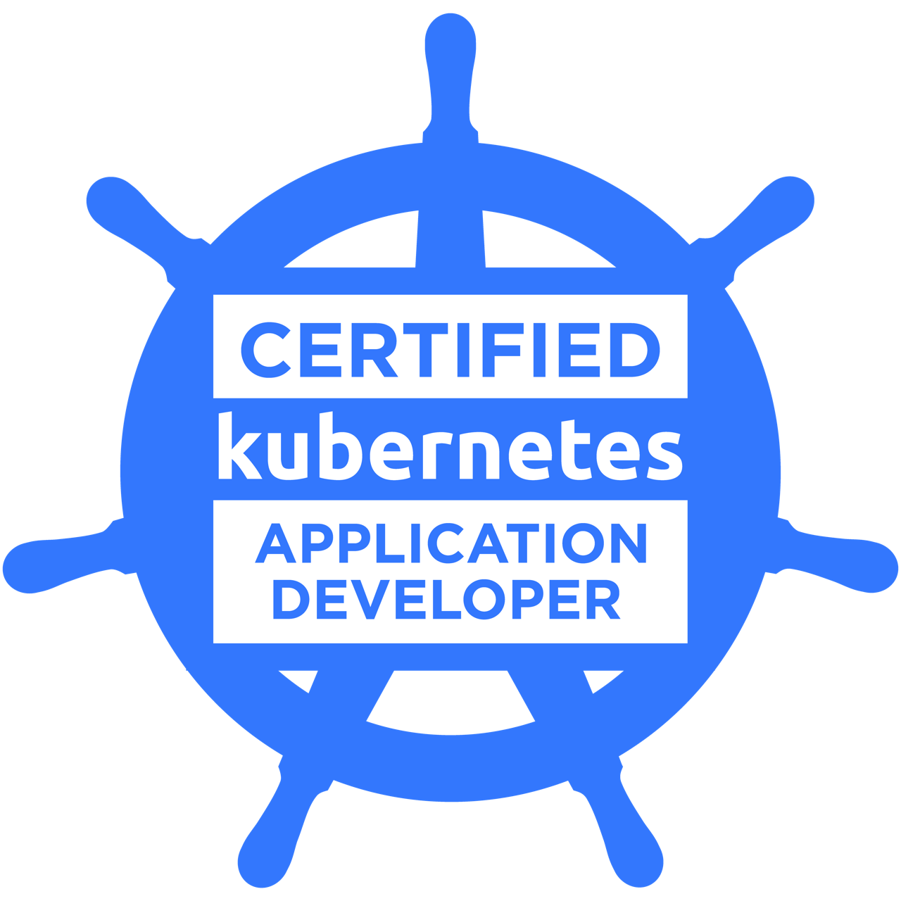
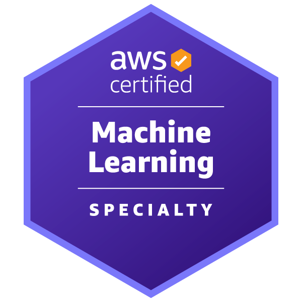
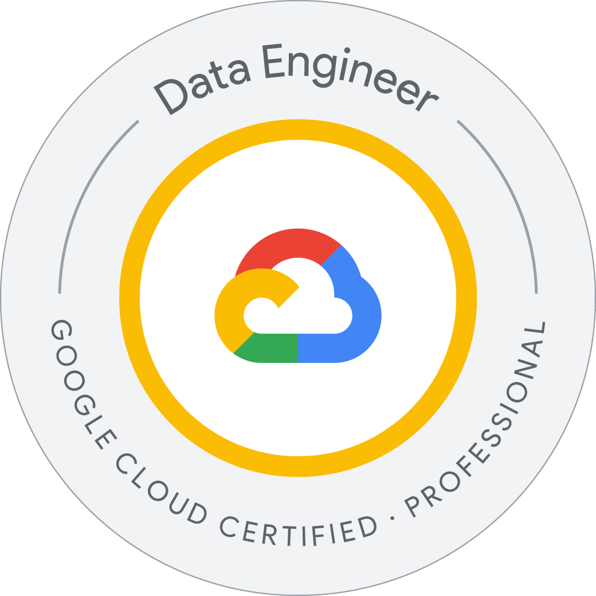
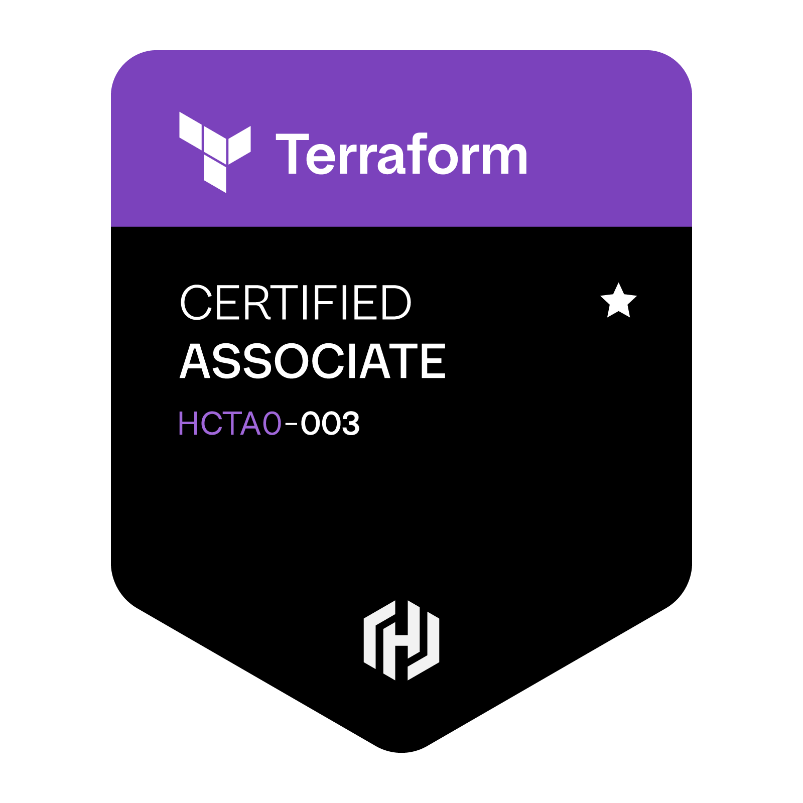
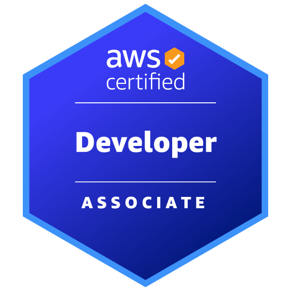
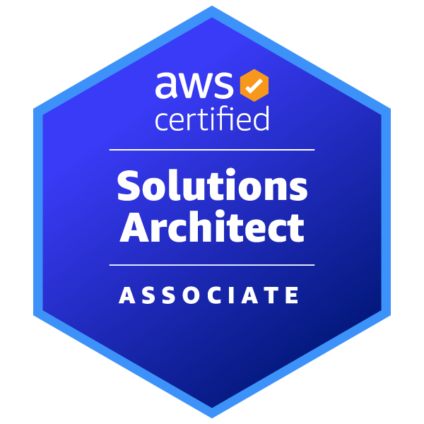
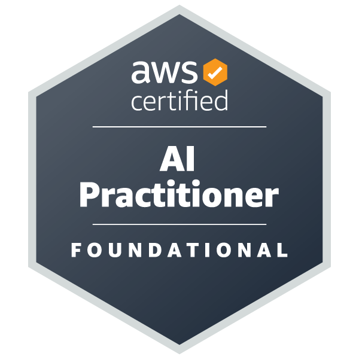
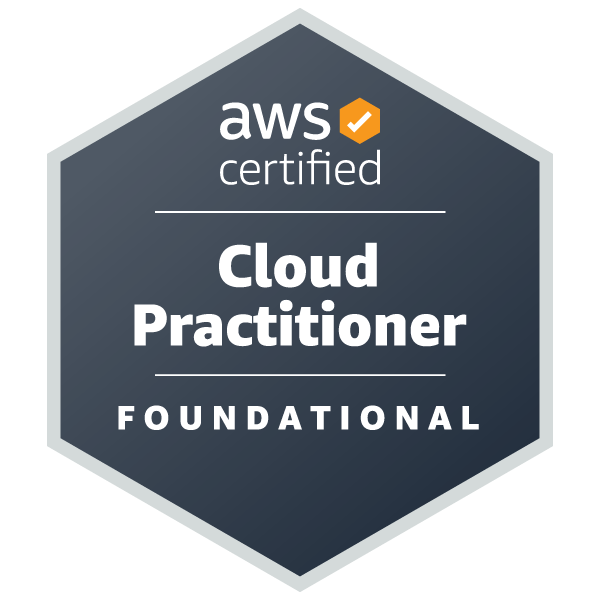

# 👋 Hi There, Welcome to My Professional World!

DevOps & Cloud Engineer with **5+ years of experience** building, deploying, and operating **cloud-native applications and infrastructure**.  
Experienced in **CI/CD automation, Kubernetes-based deployments, Infrastructure as Code, and cloud platforms (AWS & GCP)**.
Passionate about **automation, scalable infrastructure, and reliable production systems**.

---

## 💼 Professional Summary- **5+ years of experience** across application deployment, cloud infrastructure, and DevOps practices.

- Hands-on experience managing the **full DevOps lifecycle**, including build, deployment, monitoring, and production support.
- Strong experience in **CI/CD pipeline automation** using Jenkins and modern DevOps tools.
- Experience deploying and managing **containerized applications** using Docker and Kubernetes.
- Proficient in **Infrastructure as Code (IaC)** using Terraform for provisioning and managing cloud infrastructure.
- Experience working with **cloud platforms (AWS, AZURE & GCP)** including compute, networking, and storage services.
- Strong experience in **Linux environments**, scripting (Bash/Python), and troubleshooting production systems.
- Experience with **monitoring, logging, and alerting tools** to maintain system reliability and respond to production incidents.
- Experienced working in **Agile environments**, collaborating with development and operations teams to support application delivery and infrastructure.
---

## 🎓 Education

- **Master's in Computer Science**, Kent State University, May 2025. 

- **Bachelor's in Electronics and Communication Engineering**, JNTUK, May 2019.  

---

## 🛠️ Tech Stack

| Category | Technologies |
|--------|--------------|
| **Operating Systems** | Linux, Unix, Windows |
| **Cloud Platforms** | **AWS**: EC2, S3, IAM, VPC, ELB, Auto Scaling, CloudWatch, RDS   **Azure**: Virtual Machines, Blob Storage, Virtual Network (VNet), Azure Kubernetes Service (AKS), Azure SQL Database, Azure Monitor, Azure Load Balancer   **GCP**: Compute Engine, Cloud Storage, VPC, BigQuery, Kubernetes Engine |
| **Containerization** | Docker |
| **Container Orchestration** | Kubernetes |
| **CI/CD** | Jenkins, GitHub Actions |
| **Infrastructure as Code** | Terraform |
| **Monitoring & Logging** | CloudWatch, Splunk, New Relic |
| **Programming & Scripting** | Python, Bash, Java |
| **Version Control** | Git, SVN |
| **Build Tools** | Maven, Gradle |
| **Databases** | Oracle, MySQL, SQL Server, MongoDB, Cassandra |
| **Data & Distributed Systems** | Apache Spark (PySpark), Kafka, Hadoop, Hive |
| **Collaboration & Tracking** | Jira |
| **Methodologies** | Agile, Scrum |

---

## 📜 Certifications
- ***CKAD: Certified Kubernetes Application Developer***
- ***AWS Certified Machine Learning - Specialty***
- ***GCP Professional Data Engineer***
- ***AWS Certified Solutions Architect - Associate***
- ***AWS Certified Developer – Associate***
- ***Hashi Corp Certified: Terraform Associate (003)***
- ***SnowPro Associate: Platform Certification***
- ***Academy Accreditation - Databricks Fundamentals***
- AWS Certified Cloud Practitioner 
- AWS Certified AI Practitioner - Beta
- AWS Cloud Quest: Cloud Practitioner
- Microsoft Certified: Security, Compliance, and Identity Fundamentals
- GitHub Foundations
- TigerGraph for ML
- TigerGraph Associate
- Apache Cassandra 3 Developer certification
- Apache Cassandra 3 Administrator certification.

---

## 💻 Projects

### 🌐 Terraform / Cloud Infrastructure

- **Provisioning an AWS EMR Cluster:**  
  [EMR Cluster using Terraform](https://github.com/Ganasai-Palakurthi/EMR_Terraform.git)  
  *A production-ready Terraform configuration that provisions an Amazon EMR cluster end-to-end.*

- **Provisioning EKS with Self-Managed Node Groups:**  
  [EKS with Self-Managed Node Groups using Terraform](https://github.com/Ganasai-Palakurthi/EKS_SelfManagedNodeGroups_Terraform.git)  
  *Automates deployment of Amazon EKS clusters with self-managed node groups using Terraform.*

- **Personal Portfolio Website:**  
  [Portfolio Website Repository](https://github.com/Ganasai-Palakurthi/portfolio.git)
  *Designed and developed a personal portfolio website to showcase projects, technical skills, certifications, and professional experience, built with modern web technologies and responsive design.*

---

## 📫 Connect with Me

  <a href="https://www.linkedin.com/in/ganasai-palakurthi-devops/" target="_blank">💼 LinkedIn</a> &nbsp;&nbsp;
  <a href="mailto:ganasaipalakurthi@gmail.com" target="_blank">✉️ Email</a> &nbsp;&nbsp;
  <a href="https://ganasaipalakurthi.medium.com/" target="_blank">📝 Medium</a> &nbsp;&nbsp;

## 🏅 Badges

  
  
  
  
  
  
  
  

<!--
**Ganasai-Palakurthi/Ganasai-Palakurthi** is a ✨ _special_ ✨ repository because its `README.md` (this file) appears on your GitHub profile.

Here are some ideas to get you started:

- 🔭 I’m currently working on ...
- 🌱 I’m currently learning ...
- 👯 I’m looking to collaborate on ...
- 🤔 I’m looking for help with ...
- 💬 Ask me about ...
- 📫 How to reach me: ...
- 😄 Pronouns: ...
- ⚡ Fun fact: ...
-->
